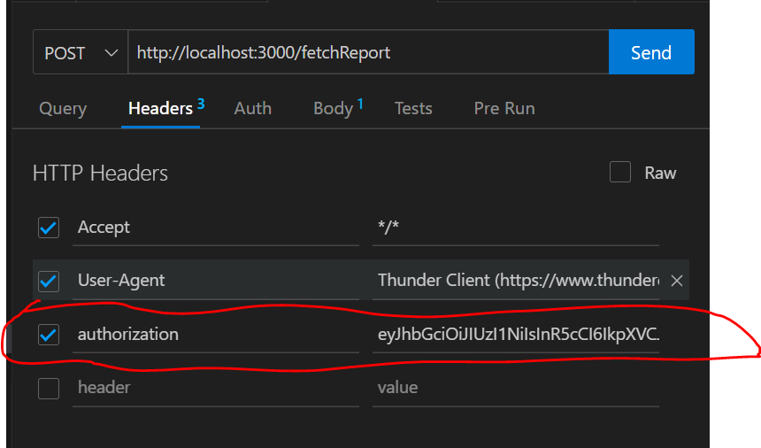

# StudioVity
Backend Software for StudioVity

Pre-requisites to install: 

1. npm i express
2. npm i cors
3. npm i nodemon
4. npm i mongoose
5. npm i dotenv
6. npm i bcrypt
7. npm i jsonwebtoken
8. npm i puppeteer

NOTE: 
1. Expiry time for token is made 15 mins for testing purposes. So, user has to login/signup again after the token has expired.
2. Secret Key for our Token is "StudioVity" (also mentioned in environmental variable).
3. Updated code is pushed into the master branch and after testing and resolving all conflicts, a pull request is generated and then it is merged into the main branch.
4. Documentation is attached under the name StudioVity.xlsx ( Link: https://docs.google.com/spreadsheets/d/1fQNTgJY5lfQEc4Js9ybZ5B1S5x4zqfqS8yQJi5CpG7o/edit?usp=sharing )
5. For testing endpoints a mandatory header "authorization" with value equal to token is kept for all endpoints, so that only authorize users present in account schema can access all the routes/endpoints.
Eg:-

6. No restrictions kept on createAccount and loginAccount so that users can get their auth-token initially.
7. fetchReport endpoint is entitled with a feature named "type" which specifies in which format user wants data of all characters. Eg:- csv,pdf or excel
